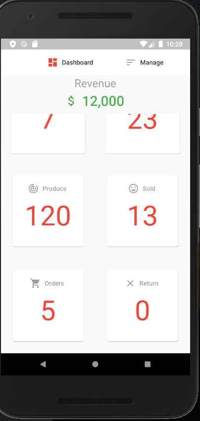

# ecommerce

A new Flutter project.

## This applications is included :
  * Firebase Database
  * Firebase FirebaseAuth
  
### Libs Used 
  * carousel_pro: ^1.0.0 ,
  * firebase_core: ^0.4.0+9 ,
  * firebase_analytics: ^5.0.2 ,
  * firestore_ui: ^1.8.0 ,
  * fluttertoast: ^3.1.3 ,
  * firebase_storage: ^3.1.1
  * uuid: ^2.0.4
  * firebase_auth: ^0.15.4
  * cupertino_icons: ^0.1.2
  * image_picker: ^0.6.3+4
  * flutter_typeahead: ^1.8.0

# Pictures

